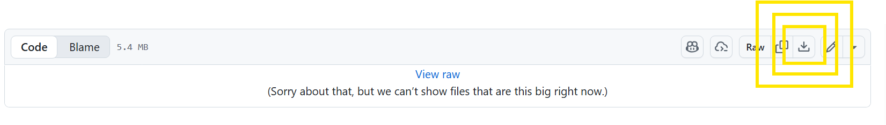
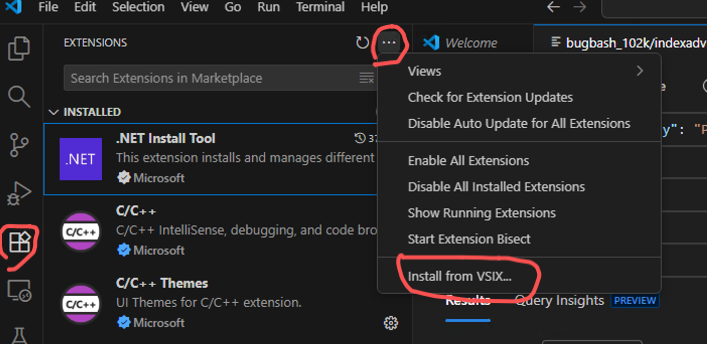
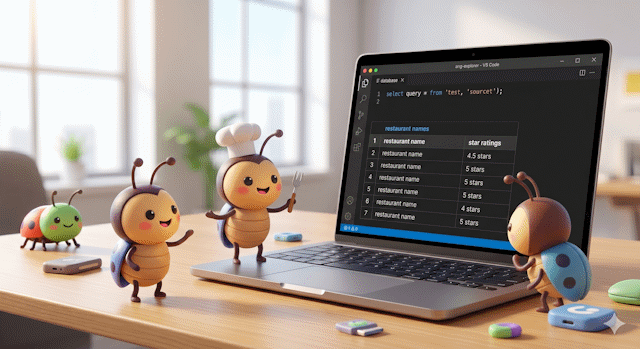
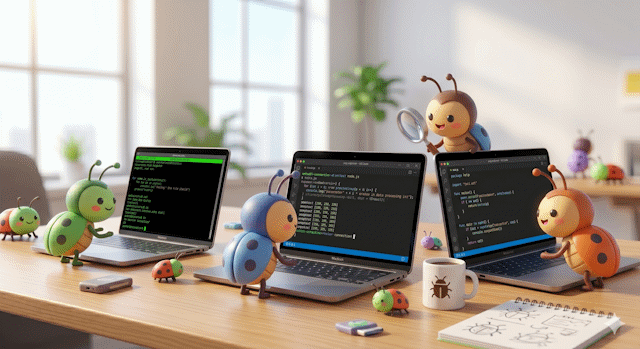

# 🐛 Bug Bash "0.8.0"

### 0. Prerequisites:

- VS Code installed on your machine
- **Optional:** your own Azure DocumentDB cluster
    - If you don't have one, we'll share access credentials for testing with you

---

### 1. DocumentDB for VS Code - download here:

- Download Link: [vscode-documentdb-0.8.0-preview-3.vsix](vsix/vscode-documentdb-0.8.0-preview-3.vsix)

- If you are launching VS Code from WSL:
    - Copy the vsix file to your home directory in WSL and then continue with the next step
- In VS Code `Extensions View`, install the extension from the artifact file by selecting `Install from VSIX...` as shown below:

---

### 2. An existing Azure DocumentDB cluster

- Use your own, but if you need help:
    - **Azure DocumentDB:**
        - `<connection string will be shared separately>`

---

## Where to file the bugs?

- **Confidential / sensitive issues:** reach out directly on Teams
- **Everything else:** file an issue on the [vscode-documentdb](https://github.com/microsoft/vscode-documentdb/issues) repository

---

## ℹ️ FYI

- When filing bugs, please include:
    - Steps to reproduce
    - Expected vs. actual behavior
    - VS Code version and OS
- When using during the bug bash / testing, use `trace` output to help with resolving issues faster. Share the trace output in your report.

---

## 🆕 What's New in 0.8.0

This release is a big one. Three new features land together:

### 🔤 Autocompletion in the Collection View
The filter, project, sort, and aggregation editors now understand your data. As you type queries, the editor suggests field names (sampled from your collection's actual schema), operators, and values, with hover documentation for every operator. No more guessing `$gte` vs `$gt`.

### 🎹 Query Playground
A new `.documentdb` file type that lets you write and run JavaScript scripts against your cluster directly inside VS Code. Each script block has its own **Run** button (CodeLens), there's a **Run All**, results appear in a dedicated tab, and `console.log()` / `print()` / `printjson()` all work. Think of it as a notebook-style scratchpad, but for DocumentDB.

We no longer depend on the `mongosh` executable being installed on your machine. The runtime is bundled directly into the extension, which means it works with Azure DocumentDB clusters that use Entra ID for authentication. (Yes, this is big. We're really proud of it.)

This also means that **installing the extension is all you need**. No cross-platform headaches, no version mismatches, no PATH configuration, no separate install steps. Everything comes preconfigured and ready to go the moment the extension is installed.

### 💻 Interactive Shell
A full REPL terminal embedded in VS Code, giving you the `mongosh` experience integrated with the extension's connection management. Open it from any database or collection in the tree view. Supports `show dbs`, `use <db>`, `help`, `it` (cursor iteration), `exit`/`quit`, and **Ctrl+C** to cancel long-running operations.

Same as the Query Playground, no external `mongosh` executable required. The runtime is bundled, so it works with Azure DocumentDB clusters that use Entra ID for authentication. (Yes, this is big. We're really proud of it.)

Again, just install the extension and you're done. No extra tools, no configuration, no surprises regardless of your OS or environment.

---

## 🎯 Bug Bash Focus

We love all three features, but this bug bash zeroes in on the **Interactive Shell** and the **Query Playground**. These are the freshest surfaces and the most likely to surprise us.

If you find time and want to hack around the collection-view autocompletion too, even better.

---

## 🧪 Test Scenarios

> **These tasks are warm-up exercises.** They've been tested and should work. The real bug bash starts when you go off-script. We're not giving step-by-step instructions, we're giving you **goals**. Explore, poke around, and try to break things.

---

### 0. Find the Query Playground and the Interactive Shell, then find `help`

**Goal:** Get oriented. Both features are new and you'll need to discover where they live in the UI. Once you find them, look for the `help` command inside each one and see what it tells you.

1. Connect to the provided cluster using the extension.
2. Locate the databases and collections in the tree view.
3. Find the **Interactive Shell** and open it.
4. Find the **Query Playground** and open it.
5. Run `help` in the Interactive Shell. What does it show?
6. Run `help` in the Query Playground. What does it show? Is it the same?

---

### 1. Query the `restaurants` collection

**Goal:** Use the **Interactive Shell** (or **Query Playground**) to find the right data.

- Connect to the provided cluster and locate the `restaurants` collection.
- Find all restaurants that are **family-friendly** and have a **rating greater than 3**.
- Then **sort the results by rating, descending**.

No hints on exact field names. Part of the task is discovering the schema.

---

### 2. Write a loop

**Goal:** Write a small script in both the **Interactive Shell** and the **Query Playground** and compare the experience.

- Write a loop that **prints your name 10 times**, with a short `sleep()` between each print.
- Run it in the **Interactive Shell** first, then try the same script in the **Query Playground**.
- The Interactive Shell is multi-line. Experiment with how `Enter` behaves as you type.
- Do the two experiences feel different? Does output appear the same way in both?

---

### 3. A long sleep

**Goal:** Test cancellation and timeout behavior.

- In the **Interactive Shell**, call `sleep(45000)` (45 seconds).
- Can you cancel it before it finishes? Does the shell stay responsive while waiting?
- If it actually times out on its own: does the error message help you understand what happened and how to fix it?

---

### 4. Switch databases mid-session

**Goal:** Test shell state persistence.

- In the Interactive Shell, connect, run a query against one database, then `use` a different database.
- Verify context switches correctly. Then switch back and confirm your previous context is still intact.

---

### 5. Open multiple shells and playgrounds

**Goal:** Stress the session management.

- Open two or three Interactive Shell tabs against the same connection simultaneously.
- Do the same with Query Playground files.
- Run things in parallel. Do they interfere? Do results land in the right tabs?

---

### 6. Freestyle - go wild 🔥

**Goal:** Do the weird thing. This is the actual bug bash.

- Run an infinite loop. Can you stop it?
- Kill your network while a query is running. (Genuinely untested, your findings matter.)
- Throw bad syntax at the playground. Are the errors helpful?
- Try things in the wrong order: query before connecting, close a tab mid-run, rapid repeated actions.

> If something feels off: file it. That's why we're here.
